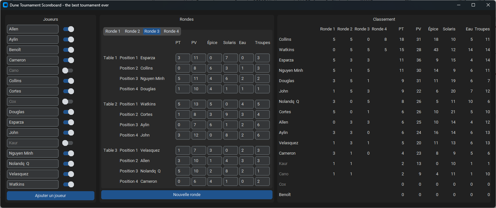

# Dune Tournament Scoreboard

This application aim to help to follow the rules of the "Championnat Francophone Dune : Imperium 2023".

See https://lucky-duck-games.notion.site/R-glement-du-Championnat-Francophone-Dune-Imperium-2023-cdff7c5434c54002896eef0a979ff06c

## Installation (DEV mode)

Use `python -m pip install --editable .` to install the CLI in editable mode.

Then, you should have the command `scoreboard` available in the terminal.

## Build

To build a standalone executable using pyinstaller:   
```
pyinstaller .\dune_tournament_scoreboard\cli\main.py --name scoreboard --icon=.\dune_tournament_scoreboard\images\dune.ico
```

## Usage

### Create a tournament

Start by creating a tournament:

```
> scoreboard tournament create the_best_tournament_ever
```

You can also list and select an existing tournament:

```
> scoreboard tournament list
the_best_tournament_ever
no_this_is_the_one
with_grand_ma
will_it_ever_finish
> scoreboard tournament select the_best_tournament_ever
```

The last created or selected tournament will be used automatically for other commands.

### Add players in your tournament

```
> scoreboard player create Smith John
> scoreboard player create Murphy Aylin
> scoreboard player create Berger Cameron
...
> scoreboard player list
ID                               NAME                 Surname              is active?
e8d0cd3104eb4107a87e5ba926869dba ALLIE                Cano                 True  
4c28ec6d2dff45589e2b13a0cfb3841a AMAIA                Nguyen               True  
7feff225e076472d8b92978826f980e9 BERGER               Cameron              True  
c572d052ce0c44bcbde1c631d441be51 BODE                 Collins              True
cd2be2e11a09412891a5c7cff9d66b72 DEBORAH              Kaur                 True
666dabf43de7471595d8af7df114e6c6 DENVER               Esparza              True
de04cbec8f1548a19ef03caa21ccd295 ELIEL                Cortes               True
0b69e5c71780458799a3e58c51d874bf FAITH                Nolan                True
e96e4555d6e74925af3891bf16c5c585 JIANNA               Douglas              True
fce43b91f0f643868f3d0185acf8c4f3 KAMARI               Cox                  True
4f306b259bfd4746b6ffb85c60c7b344 MURPHY               Aylin                True
3216d77fb32e4f4ca77f2a76e1f075c7 QUEEN                Allen                True
77e396a5f23d47c6864c364c087663d8 RAMONA               Watkins              True
0d336e87240f4971aad297cc1d843581 SMITH                John                 True
0589fcf2f0314527b0bf1567ef1a8f6d TONY                 Velasquez            True
```

You can at any point deactivate a player:
```
> scoreboard player deactivate fce43b91f0f643868f3d0185acf8c4f3
```

A deactivated player will not be part of the newly created rounds.

### Start a new round

```
> scoreboard round new
ID                               NAME                 Surname             
c572d052ce0c44bcbde1c631d441be51 BODE                 Collins
4f306b259bfd4746b6ffb85c60c7b344 MURPHY               Aylin
77e396a5f23d47c6864c364c087663d8 RAMONA               Watkins
e8d0cd3104eb4107a87e5ba926869dba ALLIE                Cano

3216d77fb32e4f4ca77f2a76e1f075c7 QUEEN                Allen
7feff225e076472d8b92978826f980e9 BERGER               Cameron
de04cbec8f1548a19ef03caa21ccd295 ELIEL                Cortes
0589fcf2f0314527b0bf1567ef1a8f6d TONY                 Velasquez

e96e4555d6e74925af3891bf16c5c585 JIANNA               Douglas
0d336e87240f4971aad297cc1d843581 SMITH                John
666dabf43de7471595d8af7df114e6c6 DENVER               Esparza

4c28ec6d2dff45589e2b13a0cfb3841a AMAIA                Nguyen
0b69e5c71780458799a3e58c51d874bf FAITH                Nolan
cd2be2e11a09412891a5c7cff9d66b72 DEBORAH              Kaur

```

We see the created tables. Here, two 4 players and two 3 players tables for a total of 14 players.
Note that KAMARI Cox was deactivated and is thus not present.

You can see those tables again without creating a new round using the command 

```
> scoreboard round tables
```

### Play the round and enter the scores

After the round is played (this should be the long part), you can enter the scores:

```
> scoreboard round update c572d052ce0c44bcbde1c631d441be51 5 10 6 3 1 4
> scoreboard round update 4f306b259bfd4746b6ffb85c60c7b344 3 7 6 4 3 3
> scoreboard round update 77e396a5f23d47c6864c364c087663d8 0 4 1 8 1 5
> scoreboard round update e8d0cd3104eb4107a87e5ba926869dba 1 4 2 3 1 4
...
> scoreboard round scores
ID                               NAME                 Surname                    TP       VP    Spice  Solaris    Water   Troops
c572d052ce0c44bcbde1c631d441be51 BODE                 Collins                     5       10        6        3        1        4
4f306b259bfd4746b6ffb85c60c7b344 MURPHY               Aylin                       3        7        6        4        3        3
77e396a5f23d47c6864c364c087663d8 RAMONA               Watkins                     0        4        1        8        1        5
e8d0cd3104eb4107a87e5ba926869dba ALLIE                Cano                        1        4        2        3        1        4

3216d77fb32e4f4ca77f2a76e1f075c7 QUEEN                Allen                       0        5        4        3        0        5
7feff225e076472d8b92978826f980e9 BERGER               Cameron                     3       10        1        5        3        2
de04cbec8f1548a19ef03caa21ccd295 ELIEL                Cortes                      5       11        5        6        1        6
0589fcf2f0314527b0bf1567ef1a8f6d TONY                 Velasquez                   1        8        5        5        1        6

e96e4555d6e74925af3891bf16c5c585 JIANNA               Douglas                     3       10        5       10        2        5
0d336e87240f4971aad297cc1d843581 SMITH                John                        1        4        4        7        4        5
666dabf43de7471595d8af7df114e6c6 DENVER               Esparza                     5       13        5        3        3        5

4c28ec6d2dff45589e2b13a0cfb3841a AMAIA                Nguyen                      5       10        5        0        3        6
0b69e5c71780458799a3e58c51d874bf FAITH                Nolan                       3        9        2        3        4        3
cd2be2e11a09412891a5c7cff9d66b72 DEBORAH              Kaur                        1        9        0        5        0        0

```

Here TP means "Tournament points" and VP "Victory points".
You can verify and modify the scores even for previous rounds.
However, the generated tables cannot be changed.

### Create, play and score the next rounds

Repeat the two previous steps as many times as you decide.

You can display the current leaderboard at any point:

```
>scoreboard tournament summary
NAME                 Surname               Round 0  Round 1  Round 2       TP       VP    Spice  Solaris    Water   Troops
DENVER               Esparza                     5        3        3       11       36        9       15        4       14
AMAIA                Nguyen                      5        1        5       11       30       14        9        6       11
BODE                 Collins                     5        5        0       10       30       16        7        4       11
RAMONA               Watkins                     0        5        5       10       27       11        8        8       13
JIANNA               Douglas                     3        5        1        9       31       11       19        6        7
SMITH                John                        1        5        3        9       22        6       20        7       12
FAITH                Nolan                       3        0        5        8       26        5       11       10        6
ELIEL                Cortes                      5        0        1        6       26       10       21        5       10
QUEEN                Allen                       0        3        3        6       25       10       14        4       12
MURPHY               Aylin                       3        3        0        6       24       16       14        6       13
TONY                 Velasquez                   1        3        1        5       20       11       13        8       13
BERGER               Cameron                     3        1        0        4       23        8        9        5        6
DEBORAH              Kaur                        1        1     None        2       13        0       10        1        1
ALLIE                Cano                        1        1     None        2        9        4       11        1       10
KAMARI               Cox                      None     None     None        0        0        0        0        0        0
```

Here we see that 3 rounds were played. DEBORAH Kaur and ALLIE Cano left before the last round and thus have no tournament points for those rounds.
You see the total points for each player.


### Celebrate the champion

After all rounds are played and encoded, display for the least time the summary and declare the winner.

I hope you had a fun and entertaining tournament. You can save and share the tournament data. They are found in `data/the_best_tournament_ever.db`

## Excel version

I implemented the same logic in an Excel workbook with macros (VBA).
It may be simpler to use.

You can find into `excel/tournoi.xlsm` (in French).

## GUI version

Thanks to Christophe Broeckx who implemented a GUI for the application.



### Build

To build a standalone executable using pyinstaller:   
```
pyinstaller .\dune_tournament_scoreboard\gui\main.py --name scoreboard-gui --onefile --noconsole --icon=.\dune_tournament_scoreboard\images\dune.ico --add-data=dune_tournament_scoreboard\images\dune.ico:dune_tournament_scoreboard\images
```

## Contact

You can contact me on my mail: benoitdaene __@__ gmail.com


